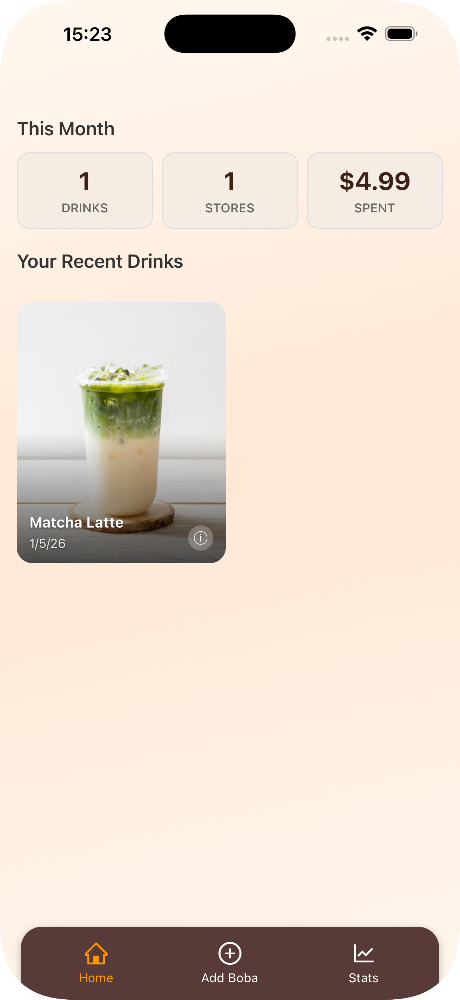
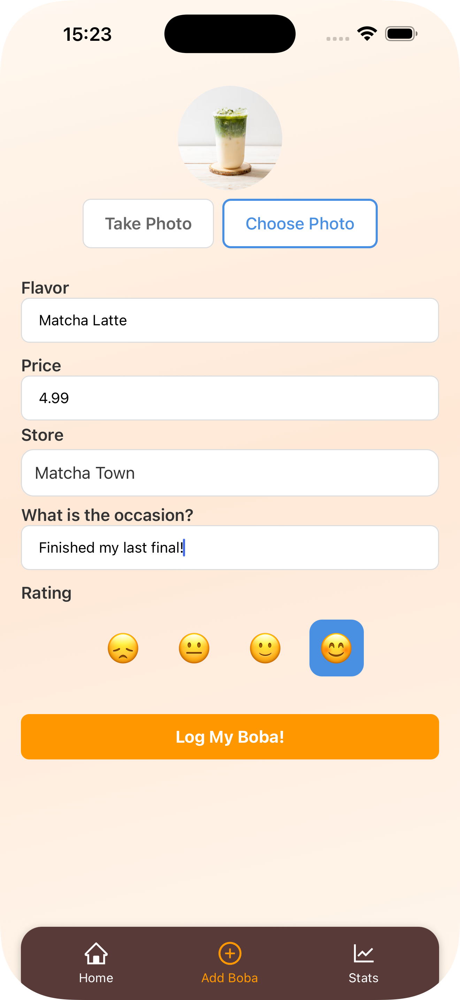
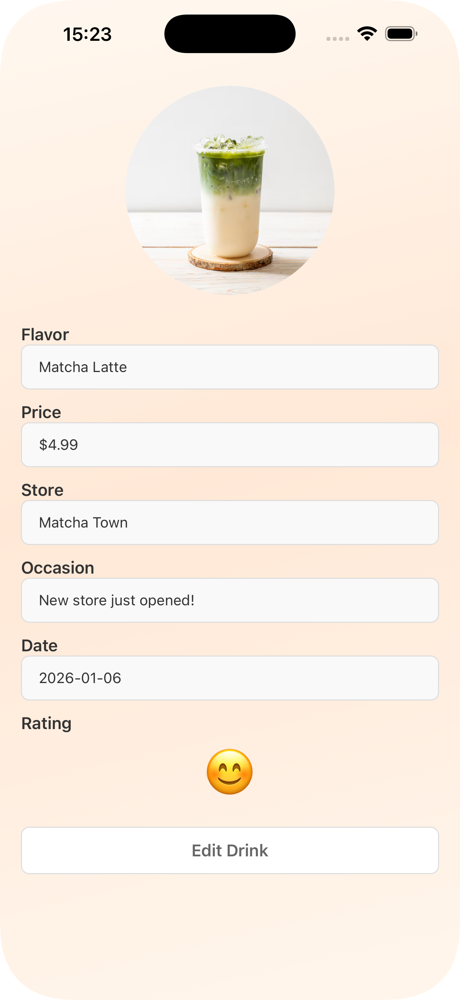
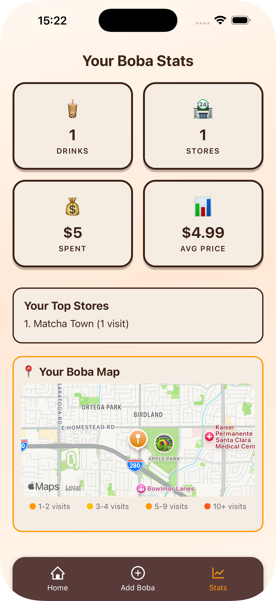

# 🧋 BobaPal

<p align="center">
  
</p>

<p align="center">
  <strong>Track your boba adventures!</strong>
</p>

<p align="center">
  A beautiful React Native app to log, rate, and discover your favorite boba drinks.
</p>

<p align="center">
  
  
  
  
</p>

---

## 📱 Screenshots

<p align="center">
  
  
  
  
</p>

---

## ✨ Features

- **📸 Photo Gallery** - Capture and browse photos of your boba drinks
- **⭐ Rating System** - Rate drinks by sweetness, ice level, and overall taste
- **📍 Location Tracking** - Find and save your favorite boba shops with Google Places autocomplete
- **📊 Statistics** - View insights about your boba habits (total drinks, spending, favorites)
- **🗺️ Visited Locations Map** - See all the boba shops you've visited on a map
- **🔐 Secure Authentication** - Sign in with Google via AWS Cognito
- **☁️ Cloud Sync** - Your data syncs securely to AWS S3
- **📱 Offline Support** - WatermelonDB provides fast local-first data storage

---

## 🛠️ Tech Stack

| Category | Technology |
|----------|------------|
| **Framework** | [React Native](https://reactnative.dev/) with [Expo](https://expo.dev/) |
| **Language** | [TypeScript](https://www.typescriptlang.org/) |
| **Styling** | [NativeWind](https://www.nativewind.dev/) (Tailwind CSS for React Native) |
| **Navigation** | [React Navigation](https://reactnavigation.org/) |
| **Database** | [WatermelonDB](https://watermelondb.dev/) (local), [AWS S3](https://aws.amazon.com/s3/) (cloud sync) |
| **Authentication** | [AWS Amplify](https://aws.amazon.com/amplify/) with Cognito & Google OAuth |
| **Location Services** | [Google Places API (New)](https://developers.google.com/maps/documentation/places/web-service/overview) |
| **Image Handling** | [Expo Image](https://docs.expo.dev/versions/latest/sdk/image/) with caching |
| **Testing** | [Jest](https://jestjs.io/) with [React Native Testing Library](https://callstack.github.io/react-native-testing-library/) |

---

## 🚀 Getting Started

### Prerequisites

- [Node.js](https://nodejs.org/) (v18 or later)
- [npm](https://www.npmjs.com/) or [yarn](https://yarnpkg.com/)
- [Expo CLI](https://docs.expo.dev/get-started/installation/)
- [EAS CLI](https://docs.expo.dev/build/setup/) (for builds)
- [Xcode](https://developer.apple.com/xcode/) (for iOS development, macOS only)
- [Android Studio](https://developer.android.com/studio) (for Android development)

### Installation

1. **Clone the repository**
   ```bash
   git clone https://github.com/yourusername/BobaPal.git
   cd BobaPal
   ```

2. **Install dependencies**
   ```bash
   npm install
   ```

3. **Set up environment variables**
   
   Create a `.env.local` file in the root directory:
   ```env
   EXPO_PUBLIC_GOOGLE_PLACES_API_KEY=your_google_places_api_key
   ```

4. **Configure AWS Amplify**
   
   Update `src/amplifyconfiguration.json` with your AWS Cognito settings:
   ```json
   {
     "aws_project_region": "your-region",
     "aws_cognito_identity_pool_id": "your-identity-pool-id",
     "aws_user_pools_id": "your-user-pool-id",
     "aws_user_pools_web_client_id": "your-client-id",
     "oauth": {
       "domain": "your-domain.auth.region.amazoncognito.com",
       "redirectSignIn": "bobapal://",
       "redirectSignOut": "bobapal://",
       "responseType": "code"
     }
   }
   ```

5. **Run the app**
   ```bash
   # Start the development server
   npm start

   # Run on iOS simulator
   npm run ios

   # Run on Android emulator
   npm run android
   ```

---

## 📜 Available Scripts

| Command | Description |
|---------|-------------|
| `npm start` | Start Expo development server (port 8085) |
| `npm run ios` | Run on iOS simulator |
| `npm run android` | Run on Android emulator |
| `npm test` | Run Jest tests |
| `npm run test:coverage` | Run tests with coverage report |
| `npm run lint` | Run ESLint and Prettier checks |
| `npm run format` | Auto-fix linting and formatting issues |
| `npm run typecheck` | Run TypeScript compiler checks |
| `npm run validate` | Run typecheck, lint, and test |
| `npm run build:dev` | Build development version via EAS |
| `npm run build:prod` | Build production version via EAS |
| `npm run prebuild:clean` | Clean and regenerate native projects |

---

## 📁 Project Structure

```
BobaPal/
├── App.tsx                 # Main app entry point
├── app.json                # Expo configuration
├── package.json            # Dependencies and scripts
├── tsconfig.json           # TypeScript configuration
│
├── assets/                 # Images, icons, and fonts
│
├── components/             # Reusable UI components
│   ├── BottomBar.tsx       # Tab navigation bar
│   ├── Button.tsx          # Custom button component
│   ├── FormField.tsx       # Form input component
│   ├── GradientBackground.tsx # App background gradient
│   ├── MyDrinkCard.tsx     # Drink card for gallery
│   ├── StatsCard.tsx       # Statistics display card
│   ├── StoreAutocomplete.tsx # Google Places search
│   └── VisitedLocationsMap.tsx # Map of visited stores
│
├── database/               # WatermelonDB setup
│   ├── schema.ts           # Database schema
│   ├── migrations.ts       # Database migrations
│   ├── index.ts            # Web database instance
│   ├── index.native.ts     # Native database instance
│   └── model/              # Data models
│
├── hooks/                  # Custom React hooks
│   ├── useCurrentUser.ts   # Get authenticated user
│   ├── useLocation.ts      # Location permissions
│   └── useS3Image.ts       # S3 image loading
│
├── pages/                  # Screen components
│   ├── Gallery.tsx         # Main drink gallery
│   ├── AddDrink.tsx        # Add new drink form
│   ├── EditDrink.tsx       # Edit drink form
│   ├── DrinkDetail.tsx     # Drink details view
│   └── Stats.tsx           # Statistics dashboard
│
├── services/               # Business logic
│   ├── imageCacheService.ts # Image caching
│   ├── locationService.ts   # Location services
│   ├── placesService.ts     # Google Places API
│   ├── storageService.ts    # S3 storage
│   └── syncService.ts       # Cloud sync
│
├── src/
│   ├── config/             # Configuration files
│   │   └── amplify.ts      # AWS Amplify setup
│   ├── constants/          # App constants
│   │   ├── theme.ts        # Colors, spacing, typography
│   │   └── ratings.ts      # Rating options
│   └── types/              # TypeScript types
│       └── navigation.ts   # Navigation types
│
└── __tests__/              # Test files
```

---

## 🧪 Testing

BobaPal has comprehensive test coverage across components, services, and hooks.

```bash
# Run all tests
npm test

# Run tests in watch mode
npm run test:watch

# Generate coverage report
npm run test:coverage
```

---

## 🏗️ Building for Production

### Using EAS Build

1. **Configure EAS**
   ```bash
   eas login
   eas build:configure
   ```

2. **Set EAS Secrets**
   ```bash
   eas secret:create --name EXPO_PUBLIC_GOOGLE_PLACES_API_KEY --scope project
   ```

3. **Build for platforms**
   ```bash
   # Development build
   npm run build:dev

   # Production build
   npm run build:prod

   # iOS only
   npm run build:ios

   # Android only
   npm run build:android
   ```

4. **Submit to app stores**
   ```bash
   npm run submit:ios
   npm run submit:android
   ```

See [PRODUCTION_CHECKLIST.md](PRODUCTION_CHECKLIST.md) for a detailed deployment guide.

---

## 🔐 Security

- **Authentication**: Handled by AWS Cognito with Google OAuth
- **Data Storage**: Encrypted at rest in AWS S3
- **API Keys**: Stored securely via EAS Secrets (not committed to repo)
- **Local Database**: WatermelonDB with SQLite (device storage)

---

## 📄 Documentation

- [Production Checklist](PRODUCTION_CHECKLIST.md) - Pre-release checklist
- [Deployment Guide](DEPLOYMENT.md) - Full deployment instructions
- [Privacy Policy](PRIVACY_POLICY.md) - App privacy policy

---

## 🤝 Contributing

Contributions are welcome! Please follow these steps:

1. Fork the repository
2. Create a feature branch (`git checkout -b feature/amazing-feature`)
3. Commit your changes (`git commit -m 'Add amazing feature'`)
4. Push to the branch (`git push origin feature/amazing-feature`)
5. Open a Pull Request

---

## 📝 License

This project is proprietary. All rights reserved.

---

## 👨‍💻 Author

**KaiDevrim**

- Website: [devrim.tech](https://devrim.tech)

---

<p align="center">
  Made with ❤️ and 🧋
</p>

